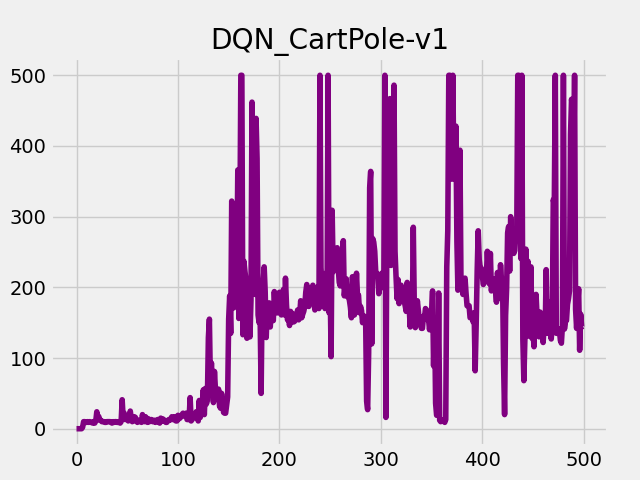

# RL-Benchmark
An RL Benchmark. Easy to use, experiment, visualize, compare results, and extend.

# Supported Algorithms
- [ ] Model-free
    - [ ] Value-based
        - [x] DQN
        - [x] Double DQN
        - [ ] Dueling DQN
    - [ ] Policy-based
        - [ ] AC
        - [ ] A2C
        - [ ] A3C
        - [ ] Reinforce
        - [ ] TRPO
        - [ ] ACKTR
        - [ ] PPO
        - [ ] DDPG
        - [ ] TD3
        - [ ] SAC
- [ ] Model-based


# Usage
Use `python run.py -h` to see the available parameters and get help.

To run a **demo**, simply run `python run.py`.

# Benchmark Results


# Implementation Details and Tricks
## DQN
1. Replay buffer: use `deque`.
2. Target network: hard update (load state dict each N iterations).
3. Only one hidden layer.
4. DQN's update utilizes `gather` in pytorch.
5. Data type: `torch.float` and `np.float`.
6. Fixed epsilon.
7. Target update=100 is worse than Target update=10.

Param:
```
Namespace(batch_size=64, benchmark='DQN', device='cuda:0', env='CartPole-v1', epoch=500, epsilon=0.01, gamma=0.95, hidden=128, lr=0.002, max_capacity=1000, plot=True, save=True, seed=0, target_update=10)
```
## Double DQN
Just change the way we computer Q target:

r + Q_target(s, a_target) -> r + Q_target(s, a_origin)

Param:
```
Namespace(batch_size=64, benchmark='DoubleDQN', device='cuda:0', env='CartPole-v1', epoch=500, epsilon=0.01, gamma=0.95, hidden=128, lr=0.001, max_capacity=1000, plot=True, save=True, seed=0, target_update=10)
```
